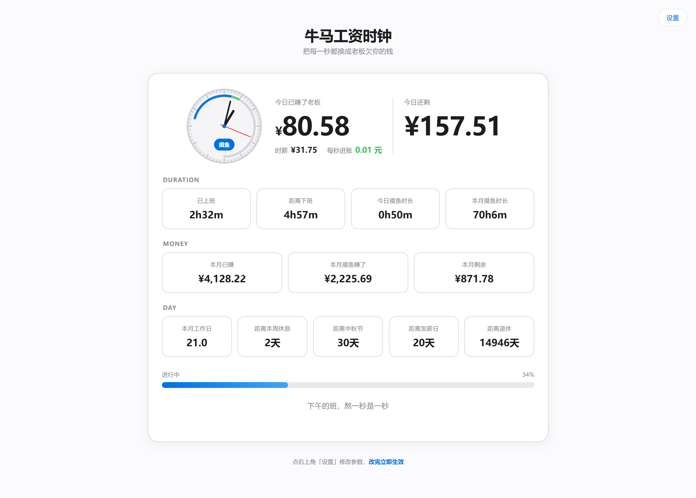

# 牛马工资时钟

> 把每一秒都换成老板欠你的钱

一个简单、有点抽象的网页工资时钟

它会根据你的月薪、工作时间和休息时间，实时计算今天已经赚了多少钱、每秒赚多少钱，以及距离下班还有多久

## 功能

* 实时计算今日已赚工资
* 显示时薪与每秒收入
* 工作时间统计
* 距离下班倒计时
* 今日 / 本月摸鱼时长统计
* 本月已赚工资与剩余工资
* 距离周末休息倒计时
* 距离法定节假日倒计时
* 距离发薪日倒计时
* 距离退休倒计时
* 支持双休、单休、无休、大小周
* 支持自定义上班 / 下班时间
* 支持自定义午休时间
* 支持导入 / 导出个人参数

## 效果图

## 本地运行

本项目是纯静态网页，不需要安装任何依赖，不会上传任何数据

直接打开 `index.html` 即可运行

项目结构：

```text
├── index.html
├── style.css
└── javascript.js
```

## 技术栈

* HTML
* CSS
* JavaScript

## 为什么做这个

因为上班的时候，最重要的事情之一就是知道：

**老板现在又欠我多少钱了**

## License

本项目采用 [MIT License](LICENSE)
